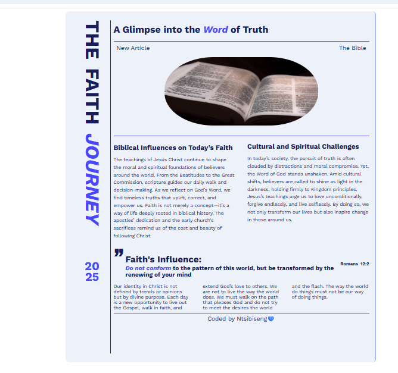

# Article-Blog page

This is a personal blog homepage that explores themes of Christian faith, spiritual growth, and biblical truth. Built as part of a front-end practice project using HTML and CSS

## Project Description

This project is a single-page HTML site designed to look and feel like a faith-based blog homepage. It combines inspirational writing with a structured and styled layout that mimics how a real blog might appear. The key content areas include:

- A bold title and subtitle
- An article header with image
- Three blog sections: **Biblical Influence**, **Spiritual Challenges**, and **Faith’s Influence**
- A highlighted Bible verse (Romans 12:2)
- Personal author credit

The goal was to build confidence in working with:
- HTML structure and elements
- CSS styling, layout, positioning, and fonts
- Designing for clarity and spiritual purpose

## Screenshot

